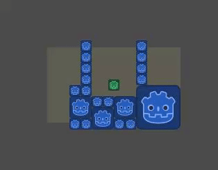

# Endless map generator system

A simple system made up of two components:

* **Chunk generator:** An `Area2D` that instances a given scene when a **trigger** collides with it.
* **Trigger:** An `Area2D` that triggers any chunk generators it comes in contact with.

## Usage

1. Copy the `endless_map_generator` folder to your project.
1. Create a trigger
    1. Add an instance of `endless_map_trigger_*.tscn` to your main camera or player.
    1. Add a `CollisionShape` as a child of the trigger. Make sure it is large enough to cover the player's entire field of view. The idea is to ensure that all chunks are generated off screen and the player can't see them popping in and out.
1. Create one or more chunk generators.
    1. Add an instance to `endless_map_chunk_*` where you want map chunks to be generated. For a top-down exploration game, consider arranging them on a grid so that chunks on the grid are generated and torn down as the player approaches them. For an endless runner, put a chunk generator at the start, then add another chunk generator inside the packed scene, where the next segment of the level is supposed to go.
    1. Add a `CollisionShape` as a child of the chunk generator. Make sure the collision shape is at least as large as the packed scene you will be passing to it.
    1. Set the chunk generator's "Spawn chunk this many levels up" parameter.
        1. If all the chunk generators are expected to live under the same parent node, leave this parameter at 0.
        1. If there are chunk generators nested within the scenes they create, set the parameter to 1, or however many levels of nesting exist between the chunk generator, and the intended parent of the generated scene.
1. Create a chunk scene. This scene represents an area in the level, such as a room in a roguelike, a track section in a racing game, a screen's worth of content in an endless runner, etc. In most cases, you'd want the contents of this chunk to be randomized. This system does not provide any randomization logic; see the "Randomized chunk generation" section for some ideas on how to implement your own.
    1. If your game's chunks connect to one another like in a racing game or an endless runner: add a chunk generator to the chunk scene, and place the generator where the next chunk needs to go.
    1. You can nest multiple generators into a chunk scene. For example, for a section of the track that splits into two.
1. Assign the chunk scene to `EndlessMapChunkGenerator*`. This scene will be instanced whenever the trigger attached to the camera collides with the scene.

## Randomized chunk generation

This system only lets you pass one chunk scene to each generator. When that generator is triggered, it will always create an instance of that same chunk scene in its place.

If you want it to generate different things each time, you need to add your randomization logic to the chunk scene's `_enter_tree` or `_ready` handler.

Here are some ways to do it:

1. **Choose a random sub-scene to instance:** See `test/endless_map_random_chunk_spawner.gd` for an example.
1. **Populate an empty scene with random content** 

